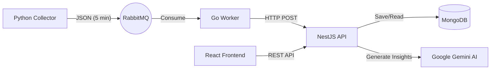

# ☀️ GDASH Energy Monitor

> Plataforma Full Stack de alta performance para monitoramento climático e análise de geração de energia solar com Inteligência Artificial.


## 📖 Sobre o Projeto

Este projeto foi desenvolvido como parte do processo seletivo da **GDASH**. O objetivo é simular um ecossistema real de IoT e Monitoramento, onde dados climáticos são coletados, processados em fila, armazenados e analisados para gerar insights sobre a eficiência de usinas fotovoltaicas.

### 🌟 Diferenciais Implementados
- **Foco em Energia Solar:** O sistema não apenas mostra o clima, mas cruza dados de radiação solar (W/m²) e nebulosidade para calcular o potencial de geração.
- **IA Generativa Real:** Integração com **Google Gemini 2.0** para gerar resumos textuais e alertas de segurança baseados no histórico das últimas 24h.
- **Resiliência:** Arquitetura distribuída com filas (RabbitMQ) e Workers com *Retry Pattern*.
- **UX Profissional:** Dashboard responsivo, Dark Mode e gráficos interativos.

---

## 🏗️ Arquitetura da Solução

O sistema segue uma arquitetura de microsserviços orientada a eventos:



| Serviço | Tecnologia | Responsabilidade |
| :--- | :--- | :--- |
| **Collector** | Python 3.11 | Coleta dados da Open-Meteo e publica na fila. |
| **Broker** | RabbitMQ | Garante a entrega assíncrona das mensagens. |
| **Worker** | Go 1.22 | Processa a fila, valida dados e envia para a API. |
| **Backend** | NestJS | API Gateway, Regras de Negócio, Auth e IA. |
| **Frontend** | React + Shadcn | Dashboard Visual e Gestão de Usuários. |

---

## 🚀 Como Rodar

### Pré-requisitos
- **Docker** e **Docker Compose** instalados.
- Uma chave de API do **Google Gemini** (Gratuita).

### Passo a Passo

1. **Clone o repositório:**
   ```bash
   git clone https://github.com/thiagoomatheus/desafio-gdash-2025-02.git
   ```

2. **Configure o ambiente:**
   Crie um arquivo `.env` na raiz do projeto e insira sua chave da IA:
   ```ini
   GEMINI_API_KEY="SUA_CHAVE_AQUI"
   JWT_SECRET="seu_segredo_seguro"
   ```

3. **Suba os containers:**
   ```bash
   docker-compose up --build
   ```
   *Aguarde alguns instantes. O Backend precisa compilar e o RabbitMQ inicializar.*

4. **Acesse a aplicação:**

   | Aplicação | URL | Credenciais Padrão |
   | :--- | :--- | :--- |
   | **Frontend (Dashboard)** | [http://localhost:5173](http://localhost:5173) | `admin@example.com` / `123456` |
   | **Backend API (Swagger)** | [http://localhost:3000/api/docs](http://localhost:3000/api/docs) | - |
   | **RabbitMQ Management** | [http://localhost:15672](http://localhost:15672) | `user` / `password` |

---

## 🛠️ Detalhes Técnicos e Decisões

### 1. Ingestão de Dados (Python & Go)
- O **Python** coleta dados a cada 5 minutos (ajustado para dinamismo no teste).
- O **Go** implementa *Exponential Backoff* para conectar no RabbitMQ e trata erros HTTP do backend (4xx descarta, 5xx tenta novamente).

### 2. Backend (NestJS + Mongoose)
- **Schema Híbrido:** Utilizamos campos na raiz para indexação rápida e um campo JSON (`fullData`) para flexibilidade.
- **Agregação:** O cálculo de médias e soma de radiação solar é feito via Pipeline de Agregação do MongoDB, garantindo performance.
- **Segurança:** Autenticação JWT completa e proteção contra exclusão do usuário Root.

### 3. Inteligência Artificial (Gemini)
- O sistema envia para a IA o contexto atual + resumo estatístico das últimas 24h.
- A IA retorna um JSON estruturado com *Summary* e *Cards* (Energia, Clima, Saúde).

### 4. Frontend (React + Vite)
- **Shadcn UI + Tailwind:** Para uma interface limpa, acessível e consistente.
- **TanStack Query:** Gerenciamento de estado do servidor, cache e polling automático.
- **Recharts:** Visualização de dados com gráficos compostos (Área + Linha).

---

## 🧪 Funcionalidades Extras (Bônus)

- [x] **Dark Mode:** Tema claro/escuro persistente.
- [x] **Soft Delete:** Usuários deletados são apenas marcados como inativos.
- [x] **Exportação:** Download de histórico em **Excel (XLSX)** formatado e CSV.
- [x] **SpaceX API:** Módulo extra consumindo API externa com paginação.
- [x] **Monitoramento Solar:** Cálculo de W/m² e Índice UV.

---

## 📹 Vídeo Demonstrativo

[Link para o vídeo no YouTube (Não Listado)](SEU_LINK_AQUI)

---

Desenvolvido por **[Seu Nome]** para o processo seletivo GDASH.